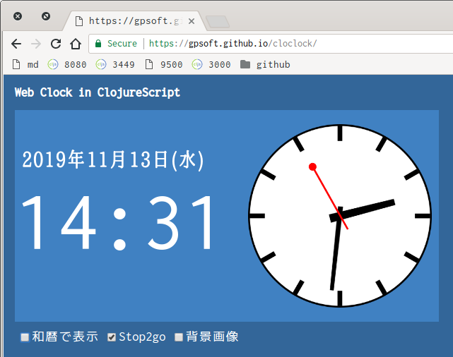

# ClojureScript作るWebクロック

[日付と時刻を表示するアプリ(https://gpsoft.github.io/cloclock/)](https://gpsoft.github.io/cloclock/)。

## 見どころ

- [Mondaineのstop2go](https://www.mondainewatch.jp/fs/mondaine/c/column0004)をシミュレート
- 時間帯に応じて背景画像を変更

## 開発ツール

- Clojure CLI tools
- figwheel-main
- re-frame, reagent, react
- nREPL, Piggeback, Vim

## 開発

    $ clojure -Adev

Clojure/ClojureScript関連のツールをインストールしてない(または、したくない)という場合は、[Dockerベースの開発環境](https://github.com/gpsoft/doclj)でもオーケイ。
